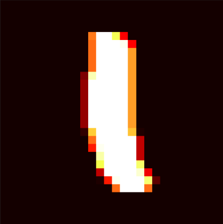
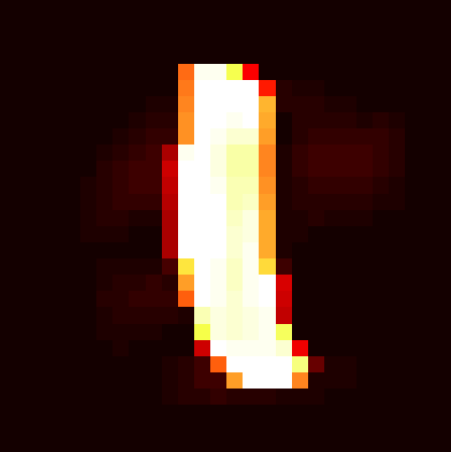
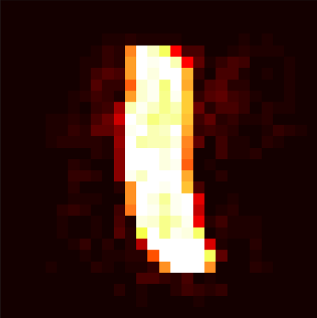
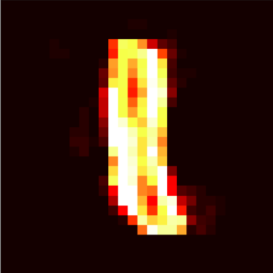
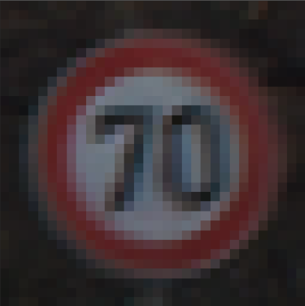

## [Formal Guarantees on the Robustness of a Classifier against Adversarial Manipulation, NIPS 2017](http://www.ml.uni-saarland.de/Publications/HeiAnd-FormGuarAdvManipLongVersion.pdf)
#### Matthias Hein, Maksym Andriushchenko
#### Saarland University

From left to right: original image (1) and adversarial examples for a 1 hidden layer NN trained with _weight decay_ (2), _dropout_ (3) and **Cross-Lipschitz** (4) regularization.

   
   
   

The adversarial examples were generated using the proposed method with a binary search, such that they are located on the decision boundary between 2 classes. So there are no overshoots in terms of the required adversarial change.

We can see that adversarial examples generated for the NN trained with **Cross-Lipschitz** regularization in first 2 cases indeed change the class even for a human observer. However, there are still some dificulties with more abstract classes (e.g. stop signs), but in this case the required norm of the adversarial change is usually higher with **Cross-Lipschitz** regularization.
<!--   -->
<!--   -->
<!--   -->


## Example of usage
If we want to run a 32-layer ResNet on MNIST with adversarial training and with Cross-Lipschitz regularization:
```bash
python worker.py --experiment_name=advers_training --adv_train_flag --reg_type=cross_lipschitz --dataset=cifar10 --nn_type=resnet --gpu_number=0 --gpu_memory=0.6 --lr=0.2 --lmbd=0.0001 --batch_size=128 --n_epochs=200
```

You can get further information on different arguments with: `python worker.py --help`.


## Cross-Lipschitz regularizer
The most interesting piece of code is the Cross-Lipschitz regularizer in `regularizers.py`:


A better regularization would be (keeping the bounds closed):


It contains **~10 lines of code** and they are very straightforward due to `tf.gradients` used to calculate the required derivatives. It is suitable for any differentiable classifier.

Another contribution is the generation of targeted adversarial examples with box constraints, which is in `attacks.py`. 
Note, that the optimization problem being solved uses linear approximation of the classifier. 

Additionally, the only well-defined point for an adversarial change is the point on the decision boundary. In order to find it we perform a binary search for the smallest `c` in the optimization problem, which is enough to change the class. The code is in `ae_generation.py`.


## Running options
Supported neural network types:

- One hidden layer fully-connected network
- Residual Network 32 layers (implemented as suggested in [Deep Residual Learning for Image Recognition](https://www.cv-foundation.org/openaccess/content_cvpr_2016/papers/He_Deep_Residual_Learning_CVPR_2016_paper.pdf))


Regularization types:

- **`cross_lipschitz`: the proposed Cross-Lipschitz regularization**
- `weight_decay`: a standard L2 weight decay
- `dropout`: in case of ResNets it is implemented as suggested in [Wide Residual Networks](https://arxiv.org/pdf/1605.07146v1.pdf).
- `no`: no regularization.


Supported settings (if no flag specified then it will run in plain setting):

- `adv_train_flag`: adversarial training with the proposed method (wrt L2-norm)
- `augm_flag`: data augmentation


Datasets (you will need to have them in the folder data/, for details please see `data.py`):

- `mnist`
- `cifar10`
- `gtrsrb`: [German Traffic Sign dataset](http://benchmark.ini.rub.de/?section=gtsrb&subsection=dataset)

Note that the script `worker.py` saves optimization logs, different metrics and the model parameter to the corresponding folders.
In order to evaluate the upper bounds of the minimum adversarial change for each example, you can use `eval_robustness.py`. This script should be called after all models in a particular experiment are trained.


## Contact
For any questions regarding the code please contact Maksym Andriushchenko (m.**my surname**@gmail.com).
Any suggestions are always welcome.


## Citation
```
@incollection{NIPS2017_6821,
	title = {Formal Guarantees on the Robustness of a Classifier against Adversarial Manipulation},
	author = {Hein, Matthias and Andriushchenko, Maksym},
	booktitle = {Advances in Neural Information Processing Systems 30},
	editor = {I. Guyon and U. V. Luxburg and S. Bengio and H. Wallach and R. Fergus and S. Vishwanathan and R. Garnett},
	pages = {2263--2273},
	year = {2017},
	publisher = {Curran Associates, Inc.},
	url = {http://papers.nips.cc/paper/6821-formal-guarantees-on-the-robustness-of-a-classifier-against-adversarial-manipulation.pdf}
}
```

